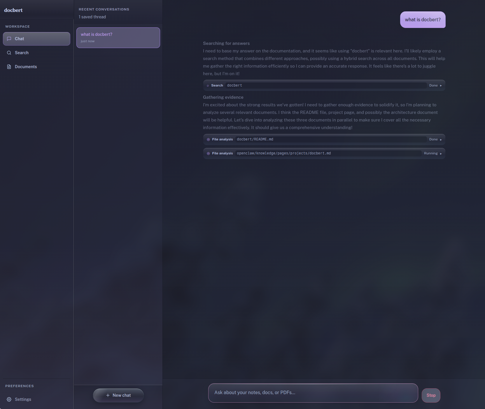

+++
date = '2026-04-13T19:04:11-03:00'
draft = false
title = 'Docbert v0.3'
+++

[docbert](https://github.com/cfcosta/docbert) started as a document search CLI. Point it at a pile of local files, index them, and get relevant results back, both from the terminal and from inside your favorite agent through MCP.

v0.3 grew into something else. 155 changed files, about 37k lines of new code since v0.2.1. The CLI and MCP server are still there, but docbert now has a web app, a better retrieval engine, and a sync model that actually works.

## A web app

v0.2.1 was a CLI and an MCP server. v0.3 adds a local web app.

`docbert web` starts an HTTP API and a browser UI from the same binary, assets embedded. It uses the same collections and indexes as the CLI, same config, same process.

During development this started as a separate `docserver` crate with its own React frontend. I ended up folding it back into docbert. It's simpler that way. You don't have to think about which thing is running or where the config lives.

You can browse your collections, read documents rendered as markdown with syntax highlighting and frontmatter, upload and delete files on the real filesystem, and search across everything. If your notes use Obsidian-style wiki links, the document previews resolve and navigate them.

Then there's chat. You pick your LLM provider in settings (OpenAI, Anthropic, or ChatGPT Plus/Pro via Codex OAuth) and the chat system uses docbert's own search to ground answers in your documents. Conversations persist. It shows reasoning blocks and tool calls inline as they happen, runs file analysis through parallel subagents, and renders search results as structured cards with excerpts. The theme is Catppuccin, it lazy-loads routes for performance, and it respects reduced-motion.

## Family-aware retrieval

Before v0.3, ColBERT reranking only scored the first chunk of each document. If the answer was in paragraph 47, it didn't matter. The system looked at whatever was at the top and scored based on that.

That was the worst quality problem in v0.2. I have notes that range from two lines to several thousand, and a retrieval system that can only look at the beginning of a document is going to miss most of the interesting stuff.

Now reranking is family-aware. docbert loads embeddings for every chunk in a document family, scores each one against the query, and keeps the best chunk score as the document-level result. `docbert ssearch` (semantic-only) does the same thing. A long document with the answer buried in the middle actually surfaces now.

## Merkle snapshots for sync

The old sync used file modification times. mtimes are unreliable across platforms and they can't tell you what was deleted.

v0.3 builds a per-collection Merkle snapshot on each sync, a deterministic hash tree of the collection contents. Diff that against the stored snapshot and you know exactly what's new, what changed, and what's gone. The mtime-based diffing is removed entirely.

## PDF, rkyv, and the rest of the internals

docbert reads PDFs now via `pdf_oxide`. Add a collection that has PDFs, sync, they get indexed.

The storage layer used to serialize metadata as null-byte-delimited strings. That's gone. Everything goes through [rkyv](https://rkyv.org) now, with typed APIs for document metadata, conversations, and settings. The compiler catches schema problems instead of you finding out through corrupted reads.

The codebase was also reorganized. `docbert-core` is its own crate now, holding the retrieval engine and storage contracts. The CLI, web server, and MCP server sit on top of it. `SearchRequestCore` became `SearchQuery`, a bunch of preparation and result types got shorter names, document reference handling was normalized. Mostly just cleaning up the mess that accumulates when a project grows this fast.

## Testing

v0.2.1 had two test files: `cli_smoke.rs` and `mcp_stdio.rs`. Now there are web API integration tests, CLI smoke tests that cover the actual command wiring, frontend integration tests for chat and documents, unit tests for the frontmatter parser and document tree transforms, and dedicated cases for reranker family collapse, semantic collection filtering, and BM25 metadata mapping.

## Smaller things

`.gitignore` rules are respected during indexing for git-backed collections. There are Arch Linux PKGBUILDs. `cargo-deny` runs as part of the build. Accessibility got some work: button labels, touch targets, minimum sizing. Nix has a Metal package variant now, CUDA is gated to Linux, and `bun2nix` handles the UI build.

## What's next

I'll keep pushing on search quality and on the web experience. [Give it a try](https://github.com/cfcosta/docbert) if you want local document search that doesn't send your files somewhere else.
