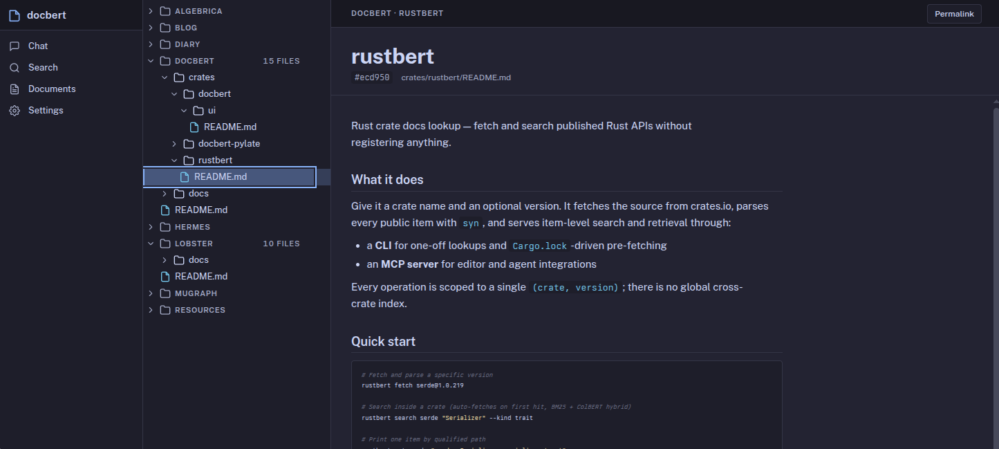
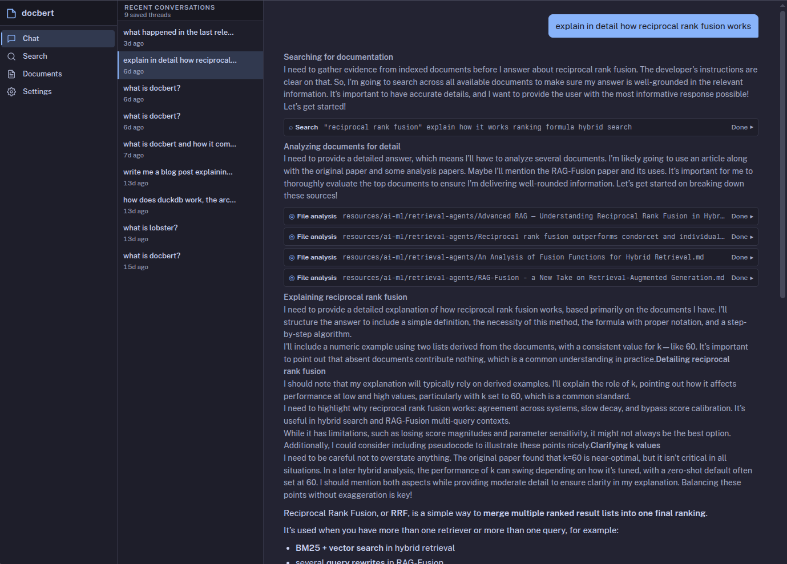

+++
date = '2026-04-29T12:15:00-03:00'
draft = false
title = 'Docbert v0.8'
+++

[docbert](https://github.com/cfcosta/docbert) is a local document search tool. You point it at your files, it indexes them, and you search from the terminal, a web app, or an MCP-connected agent. Nothing leaves your machine.

v0.8 ships token pooling so the embedding database is roughly half the size, fixes a bug that was writing wrong-dimension vectors to disk on the v0.7 default model, and rebuilds the web UI around a flatter classic-desktop look.

## Token pooling cuts the embedding database in half

ColBERT-style models produce one vector per token. A lot of those vectors carry information that's already in the vector right next to them, especially for repeated words and function words the encoder barely differentiates. Storing all of them is the price of late-interaction retrieval, and it's why a 1000-document corpus can take several gigabytes on disk.

[Clavié & Chaffin (2024)](https://arxiv.org/abs/2409.14683) noticed the redundancy and proposed collapsing similar tokens into their cluster mean at index time. Their pipeline:

1. Build the pairwise cosine distance matrix over a document's token embeddings.
2. Run hierarchical agglomerative clustering with Ward's linkage.
3. Cut the dendrogram to at most `ceil(num_tokens / pool_factor) + 1` clusters.
4. Replace each cluster with the component-wise mean of its members.

The retrieval impact on BEIR is small enough to be in the noise. From their Table 2 in the quantised setting (which is what docbert runs with PLAID): factor 2 keeps 99.64% of baseline NDCG, factor 3 stays inside 3% loss, factor 4 still around 96%. v0.8 ships factor 2 as a mandatory default with no knob to set. Factor 2 is the safe number from the paper; bigger factors trade quality for storage at a rate I don't want to make on someone else's behalf.

The implementation went through three passes. The first version applied the paper recipe straight: kodama for the linkage, mean per cluster, deterministic cluster labelling so the output didn't depend on tie-breaks. About 8 ms per 519-token document on CPU, which on a 14k-chunk personal corpus shrank the embedding database from 6.8 GB to 3.2 GB, in line with the paper's `ceil(N/2) + 1` ceiling for factor 2.

The second pass was the perf one. Building the N×N cosine-distance matrix as a scalar Rust loop was ~90% of the cost. Moving that work to a batched `tokens @ tokens.T` matmul on the encoder's device dropped per-document pooling from ~8 ms to ~760 µs:

| arm                  | time     | vs CPU |
| -------------------- | -------- | ------ |
| pool_only/2          |  8.00 ms | 1.00×  |
| pool_with_dots/2     |  761 µs  | 10.5×  |

The dots tensor is ~138 MB per 128-doc batch on top of the existing token transfer, well inside PCIe 4.0 x16. Ingestion throughput went from ~76 chunks/s with pooling-on-CPU back up to roughly its pre-pool number.

The third pass killed the second entry point. The "raw token" code path that built the dot matrix on CPU only existed as a convenience for callers without a precomputed batched matmul, and it reintroduced the quadratic scalar scan we'd just deleted. One entry point that takes a precomputed dot tensor, no backdoor.

Every document indexed under v0.8 takes about half the storage on disk, and PLAID's MaxSim runs over half as many vectors per query.

## The v0.7 default model was running at the wrong dimension

This one is worse than v0.7's "pruning was off" embarrassment, because at least pruning being off didn't change the *answers*.

v0.7 switched the default model from `lightonai/ColBERT-Zero` to `lightonai/LateOn`. They're both LightOn ColBERT models on the ModernBERT-base backbone, documented as 128-dim. The catch is that LateOn has a 3-layer Dense projection chain in its `modules.json`: `1_Dense (768 → 1536, residual)` → `2_Dense (1536 → 768, residual)` → `3_Dense (768 → 128)`. docbert's loader hardcoded a single `1_Dense` projection, applied it, and stopped. So every LateOn embedding written to disk under v0.7 was 1536-dim instead of 128-dim. The PLAID index, search, MaxSim, and the codec all worked at 1536-dim, which is internally consistent, but it isn't the model the BEIR numbers in the v0.7 post were measuring.

v0.8 reads the full `modules.json`, collects every `pylate.models.Dense.Dense` entry in declaration order, downloads each module's weights, and applies them as a chain. PyLate's `use_residual=true` is a parallel learned projection (`linear(x) + residual(x)` of the same shape) rather than a classic skip connection, so the residual branch loads as its own bias-free Linear over the `residual.*` weights. The loader fails fast on `bias=true` or any non-Identity activation. No LightOn ColBERT ships either today, and after this release I'd rather error on an unfamiliar config than guess at it.

Single-Dense models behave exactly as before: ColBERT-Zero, colbertv2.0, answerai-colbert-small, GTE-ModernColBERT all declare only `1_Dense` with no residual.

If you've been on the v0.7 default, you have wrong-dimension embeddings on disk and a rebuild on upgrade is mandatory. Install steps below.

## The web UI looks like a desktop app now

The web app got a visual refresh. The old look leaned on gradients and card-style selection that ate space without earning it. The new one is closer to something you'd keep open all day: flatter surfaces, calmer colours, and a sidebar that reads as chrome rather than a second content panel.



Dark mode is the default, with a light variant that follows your OS preference. File-tree rows are denser and easier to scan at long lengths, with extension-coloured icons so PDFs, Markdown, code, and config files are distinguishable at a glance. Selection switched from a highlighted card to a thin coloured stripe down the left edge of the active row, the same thing VSCode and most file managers do. The eye stays on the list instead of fixating on whatever's selected.

The document preview pane got a breadcrumb strip across the top so you always know which collection and folder a document belongs to without scrolling back up. Chat, Search, and Settings picked up the same visual language, so the app stops feeling like three different sites.



## Partial reads on the web side too

MCP's `docbert_get` already accepted `startLine`/`endLine` and `startByte`/`endByte` ranges back in v0.7. v0.8 brings the same shape to the web HTTP API. `GET /v1/documents/{collection}/{*path}` now accepts the same camelCase range params, slices the on-disk content before returning it, and rejects requests that mix line and byte ranges. Each search hit carries `line_count`/`byte_count` so the agent can size a follow-up request without a second round trip.

Semantic search hits also carry a `match_chunk: { start_byte, end_byte }` field, the byte range of the actual chunk PLAID scored highest. The chat agent used to have to guess where in a long document the answer lived, working from text-match excerpts that came from the literal query string and not from the embedding score. The chunker already knew where the chunks were; that information just used to get dropped after embedding. Now it sticks around, and the chat agent's `analyze_document` can read just the matching slice instead of loading the whole file into the subagent's context.

## The rest

PLAID training stays on the GPU end-to-end now. Lloyd's M-step used to pull assignments to host as `Vec<usize>`, walk the points slice cluster-by-cluster, allocate new centroids on host, and re-upload via `Tensor::from_slice` per iteration. v0.8 does the same work in candle ops: a one-hot `[N, k]` broadcast for assignments, a matmul for the per-cluster sums, and a `where_cond` to keep `previous` for empty clusters. Everything stays on whichever device the input tensors live on. Convergence check is one scalar pull per iteration; final centroids round-trip back to host once at the end.

Search-time decode picked up VRAM bounding for high-dim models. Stage 3 of PLAID's cascade leaves `ndocs/4` candidates alive. At `top_k=80` that's 256 docs and roughly 50K tokens, and decoding them all into a single `[50K, 1536]` f32 tensor blew past the free-VRAM headroom on a 12 GiB card running LateOn. `batch_maxsim` now walks candidates in chunks whose cumulative token count stays under a dim-aware cap (~26K tokens for 128-dim, ~2K for 1536-dim), with each chunk's tensors dropped before the next uploads.

The fast-encode path stopped scanning host buffers for trailing zero-padding rows. The encoder reports real per-document token counts alongside the 3D output tensor now, so the indexer slices `data[.. lengths[i] * dim]` directly instead of walking up to 8 MB of f32 comparisons per batch looking for the padding tail.

`populate_titles` was supposed to fill in titles for semantic-only hits and skip BM25 hits that already had one. Instead, the loop unconditionally re-assigned `r.title` and clobbered the BM25 value with a path-derived fallback. The bug only surfaced on corpora large enough to train PLAID; small synthetic corpora fell back to BM25-only and never hit the codepath.

There's a sister tool now, [rustbert](https://github.com/cfcosta/rustbert). Give it a `(crate, version)` pair and it returns item-level Rust API search (signatures, docstrings, qualified paths, source spans) over MCP and a CLI. It depends on `docbert-core` as a library for storage, search, and embedding primitives, but ships its own binary against its own data directory. The Nix flake exposes `.#rustbert`, `.#rustbert-cuda`, and `.#rustbert-metal` alongside the docbert outputs. It'll get its own release post.

## Getting started

Download a binary from [GitHub releases](https://github.com/cfcosta/docbert/releases/tag/v0.8.0). Prebuilt binaries for Linux (x86_64, aarch64) and macOS (Apple Silicon), CPU-only and CUDA.

Or install through Nix or Cargo:

```bash
# Nix
nix profile install github:cfcosta/docbert

# Nix, for CUDA support (NVIDIA gpus)
nix profile install github:cfcosta/docbert#docbert-cuda

# Nix, for Metal support on Mac OS
nix profile install github:cfcosta/docbert#docbert-metal

# Cargo
cargo install --git https://github.com/cfcosta/docbert

# Cargo, for CUDA support (NVIDIA gpus)
cargo install --git https://github.com/cfcosta/docbert --features cuda
```

Then run a rebuild:

```bash
docbert rebuild
```

Whichever model you've been on, you need this. LateOn users have wrong-dimension embeddings on disk thanks to the Dense-chain bug above. ColBERT-Zero users have valid embeddings, but they don't have the token-pooling compression yet. Collections, document metadata, and settings are preserved either way.
