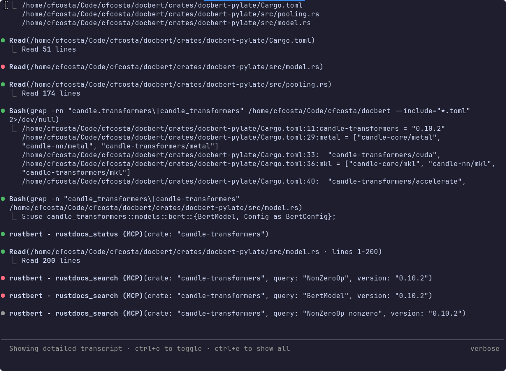

+++
date = '2026-04-29T12:45:00-03:00'
draft = false
title = 'Rustbert v0.1'
+++

[rustbert](https://github.com/cfcosta/docbert/tree/main/crates/rustbert) is a Rust crate docs lookup for AI agents. Wire up its MCP server in your editor and the LLM gets four `rustdocs_*` tools that fetch a crate from crates.io, parse it, and return item-level signatures and docstrings on demand. It's built on the same hybrid BM25 + ColBERT search stack that powers [docbert](https://github.com/cfcosta/docbert).

Say an agent is writing Rust and needs to know what `serde::Serializer::serialize_struct` looks like on `serde 1.0.219`. It calls `rustdocs_get`. rustbert fetches the crate from crates.io if it isn't already cached, parses the public API with `syn`, and hands back the signature, docstring, and source location. Subsequent calls against that crate are served from disk.



## The MCP tools

`rustbert mcp` speaks JSON-RPC 2.0 on stdio and exposes four tools:

- `rustdocs_search(crate, version?, query, kind?, module_prefix?, limit?)`: hybrid BM25 + ColBERT search inside one crate, with optional kind / module-path filters. Use this when the agent has a concept ("a trait for serializing structs") but not the exact path.
- `rustdocs_get(crate, version?, path)`: full rustdoc for one item by its qualified path.
- `rustdocs_list(crate, version?, kind?, module_prefix?, limit?)`: browse items by kind or module prefix, useful for "show me every public trait under `tokio::io`".
- `rustdocs_status(crate?)`: report which crates and versions are cached locally.

Plus the standard `initialize` / `tools/list` / `tools/call` lifecycle.

The `crate` parameter accepts a few shapes: `serde`, `serde@1.0.219`, `serde@^1.0`, `serde@latest`. `latest` resolves to the newest stable, non-yanked version on crates.io.

## What rustbert understands when it parses a crate

The parser walks an extracted crate with `syn` and emits one item per `fn`, `struct`, `enum`, `union`, `trait`, `impl`, `mod`, `const`, `static`, `type`, and `macro_rules!`. Each item carries its qualified path, signature, docstring, and source span, so a returned hit is enough to either understand the API or jump straight to the source.

Inherent impl methods are emitted as items in their own right, at `<module>::<SelfType>::<name>`. So `Tensor::matmul` is a directly-addressable item, not a method buried inside an `Impl` blob. This matches the path you'd copy out of rustdoc or out of a `use` statement.

Private modules that re-export their contents with `pub use` are walked too. A surprising amount of the ecosystem hides its main types in private container modules. `candle_core::tensor::Tensor`, `serde::Serializer`, and `reqwest::Client` all live this way, and the parser emits the inner items under the path they're reachable from at the crate root.

Trait pages get a rustdoc-style "Implementors" section. When `impl SomeTrait for SomeType` shows up in any indexed crate, the trait path resolves through that file's `use` map and a record gets stashed in a workspace-wide registry. Trait pages then merge in their implementors when rendered, so a query for a trait surfaces who implements it across every crate in the cache, not just within the trait's own crate.

What it doesn't do: type resolution, cross-crate `pub use` chasing beyond the simple cases above, or macro expansion. Macros are invisible to source-level parsing by definition, and cross-crate type resolution would be its own project.

## Search

The retrieval stack is the same one docbert uses: BM25 via Tantivy with English stemming, ColBERT via `docbert-pylate`, Reciprocal Rank Fusion at `k=60`, and PLAID to compress ColBERT's per-token vectors so MaxSim is fast. Filters like `kind=trait` and `module_prefix=serde::de` apply post-rank against the cached items.

Fetches are demand-driven. The first `rustdocs_search` against a crate that isn't cached fetches and parses it on the spot, then runs BM25 over what just landed in the cache. Single-crate auto-fetch stays lexical-only. Loading the ColBERT model just to embed one new crate would stall the agent for several seconds, which is the wrong shape for a single tool call.

## Getting started

Download a binary from [GitHub releases](https://github.com/cfcosta/docbert/releases/tag/rustbert-v0.1.0). Prebuilt for Linux (x86_64, aarch64) and macOS (Apple Silicon, with Metal).

Or install through Nix or Cargo:

```bash
# Nix
nix profile install github:cfcosta/docbert#rustbert

# Nix, for CUDA support (NVIDIA gpus)
nix profile install github:cfcosta/docbert#rustbert-cuda

# Nix, for Metal support on Mac OS
nix profile install github:cfcosta/docbert#rustbert-metal

# Cargo
cargo install --git https://github.com/cfcosta/docbert rustbert

# Cargo, for CUDA support (NVIDIA gpus)
cargo install --git https://github.com/cfcosta/docbert rustbert --features cuda
```

Then wire the MCP server up in your agent's config. The server is invoked as `rustbert mcp` and speaks JSON-RPC 2.0 on stdio.

For Claude Code, drop this into `.mcp.json` at the project root, or `~/.claude.json` for a user-wide install:

```json
{
  "mcpServers": {
    "rustbert": {
      "command": "rustbert",
      "args": ["mcp"]
    }
  }
}
```

Or run `claude mcp add rustbert rustbert mcp` and Claude Code will write the config for you.

For Codex CLI, add this to `~/.codex/config.toml`:

```toml
[mcp_servers.rustbert]
command = "rustbert"
args = ["mcp"]
```

Restart your agent. The four `rustdocs_*` tools show up in its tool list and the LLM can call them directly the next time you ask about a Rust API.
